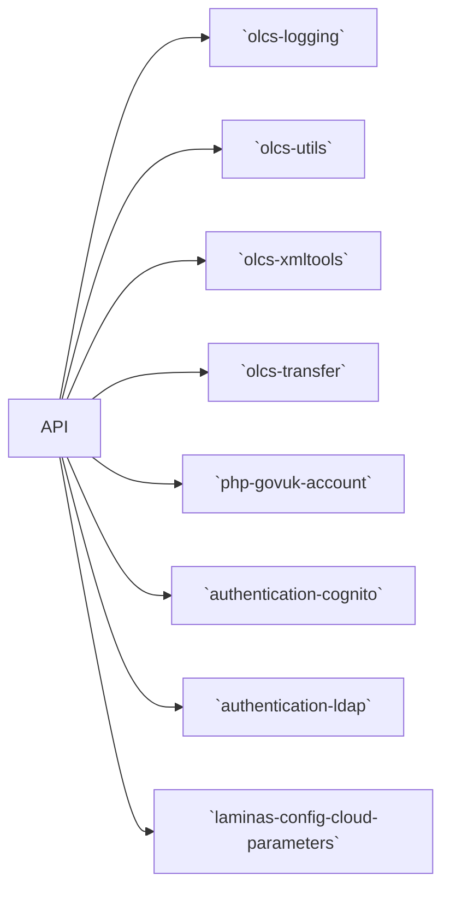
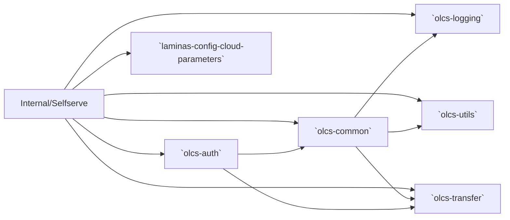

# Overview

The VOL service is distributed across three PHP applications built on the Laminas MVC framework:

-   **API**: The backend service.
-   **Selfserve**: The public-facing application.
-   **Internal**: The internal-facing application.

These applications are supported by several internal libraries.

## Internal Dependencies

| Library                           | Description                                                            | Link                                                                   |
| --------------------------------- | ---------------------------------------------------------------------- | ---------------------------------------------------------------------- |
| `authentication-cognito`          | PHP adapter for AWS Cognito authentication                             | [GitHub](https://github.com/dvsa/authentication-cognito)               |
| `authentication-ldap`             | PHP adapter for LDAP authentication                                    | [GitHub](https://github.com/dvsa/authentication-ldap)                  |
| `laminas-config-cloud-parameters` | Replaces Laminas configuration placeholders with cloud provider values | [GitHub](https://github.com/dvsa/dvsa-laminas-config-cloud-parameters) |
| `olcs-auth`                       | Authentication management                                              | [GitHub](https://github.com/dvsa/olcs-auth)                            |
| `olcs-common`                     | Shared code for frontend applications                                  | [GitHub](https://github.com/dvsa/olcs-common)                          |
| `olcs-logging`                    | Logging utilities                                                      | [GitHub](https://github.com/dvsa/olcs-logging)                         |
| `olcs-transfer`                   | Data Transfer Objects (DTOs)                                           | [GitHub](https://github.com/dvsa/olcs-transfer)                        |
| `olcs-utils`                      | Shared utility functions                                               | [GitHub](https://github.com/dvsa/olcs-utils)                           |
| `olcs-xmltools`                   | XML processing tools                                                   | [GitHub](https://github.com/dvsa/olcs-xmltools)                        |
| `php-govuk-account`               | PHP adapter for GOV.UK One Login                                       | [GitHub](https://github.com/dvsa/php-govuk-account)                    |

### Dependency tree

#### API

#### Frontend

