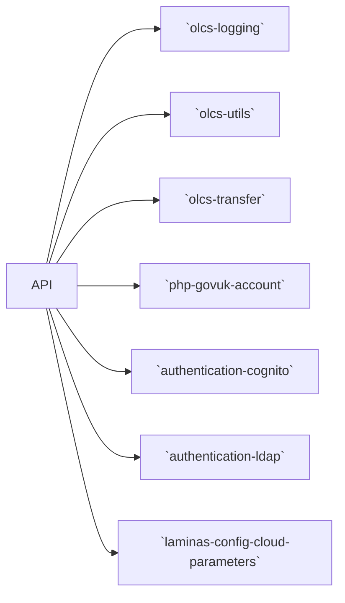
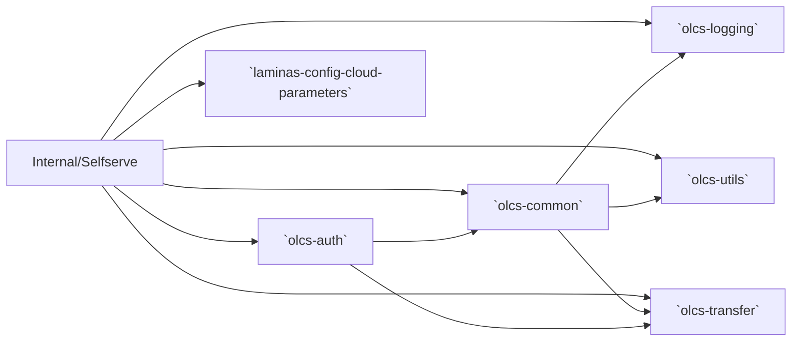

# Overview

The VOL service is distributed across three PHP applications built on the Laminas MVC framework:

- **API**: The backend service.
- **Selfserve**: The public-facing application.
- **Internal**: The internal-facing application.

These applications are supported by several shared libraries that live **in-tree** within this monorepo, alongside a small number of external Composer dependencies.

## Shared libraries (in-tree)

Previously published as standalone `dvsa/olcs-*` packages, these libraries have been consolidated into vol-app. Each keeps its own `composer.json` (and its own test suite and tooling) and is consumed by the applications via relative path repositories, which Composer symlinks into each app's `vendor/olcs/*`.

| Library         | Description                              | Location             |
| --------------- | ---------------------------------------- | -------------------- |
| `olcs-logging`  | Logging utilities                        | `lib/olcs-logging/`  |
| `olcs-utils`    | Shared utility functions                 | `lib/olcs-utils/`    |
| `olcs-transfer` | Data Transfer Objects (DTOs) and routing | `lib/olcs-transfer/` |
| `olcs-common`   | Shared code for frontend applications    | `lib/olcs-common/`   |
| `olcs-auth`     | Authentication management                | `lib/olcs-auth/`     |

`olcs-xmltools` was also absorbed, but — being API-only — it is fully inlined as an API module at `app/api/module/XmlTools/` rather than a path-repository library.

## External dependencies

These are still consumed as published Composer packages.

| Library                           | Description                                                            | Link                                                                   |
| --------------------------------- | ---------------------------------------------------------------------- | ---------------------------------------------------------------------- |
| `authentication-cognito`          | PHP adapter for AWS Cognito authentication                             | [GitHub](https://github.com/dvsa/authentication-cognito)               |
| `authentication-ldap`             | PHP adapter for LDAP authentication                                    | [GitHub](https://github.com/dvsa/authentication-ldap)                  |
| `laminas-config-cloud-parameters` | Replaces Laminas configuration placeholders with cloud provider values | [GitHub](https://github.com/dvsa/dvsa-laminas-config-cloud-parameters) |
| `php-govuk-account`               | PHP adapter for GOV.UK One Login                                       | [GitHub](https://github.com/dvsa/php-govuk-account)                    |

### Dependency tree

The relationships below are unchanged by the consolidation; the `olcs-*` nodes now resolve to the in-tree `lib/` directories rather than external packages.

#### API

```mermaid
flowchart LR
    api["API"]

    api --> `olcs-logging`
    api --> `olcs-utils`
    api --> `olcs-transfer`
    api --> `php-govuk-account`
    api --> `authentication-cognito`
    api --> `authentication-ldap`
    api --> `laminas-config-cloud-parameters`
```

#### Frontend

```mermaid
flowchart LR
    frontend["Internal/Selfserve"]

    frontend --> `olcs-common`
    frontend --> `olcs-logging`
    frontend --> `olcs-auth`
    frontend --> `olcs-transfer`
    frontend --> `olcs-utils`
    frontend --> `laminas-config-cloud-parameters`

    `olcs-common` --> `olcs-logging`
    `olcs-common` --> `olcs-utils`
    `olcs-common` --> `olcs-transfer`

    `olcs-auth` --> `olcs-common`
    `olcs-auth` --> `olcs-transfer`
```
