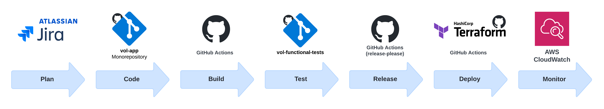
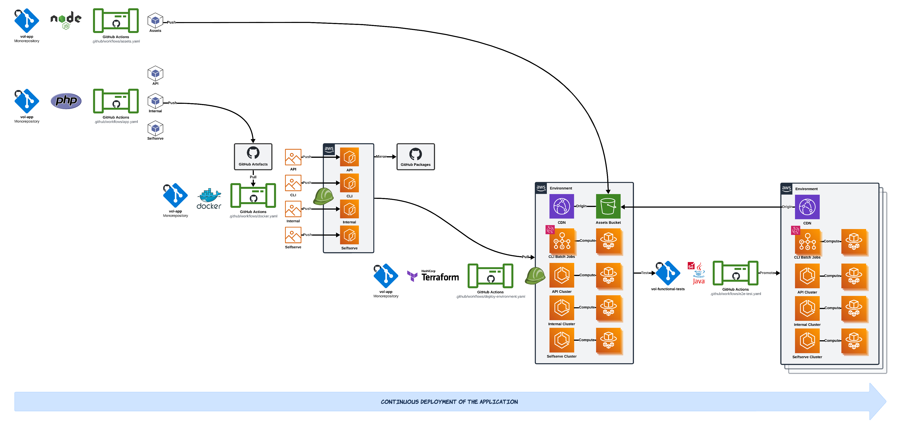
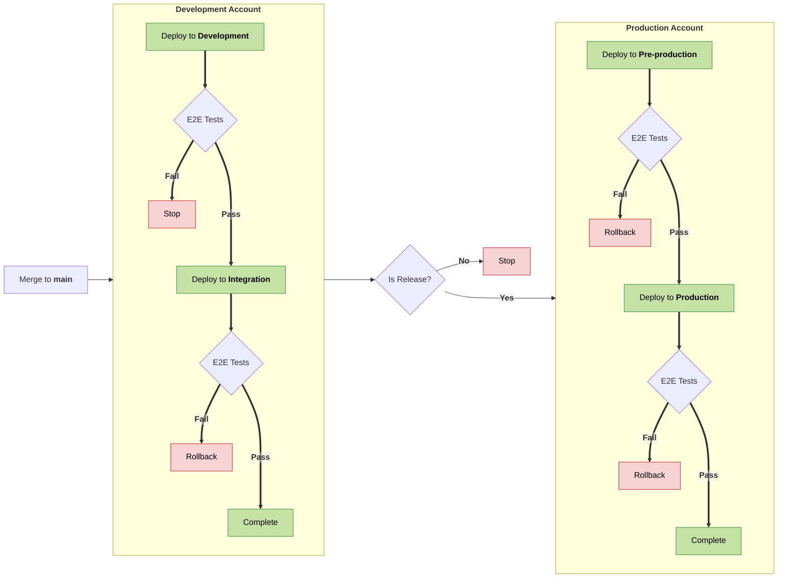

# CI/CD

At a high level, the VOL application's CI/CD pipeline can be visualised as follows:

## Continuous Integration (CI)

:::note

Only parts of the application that have changed are updated during continuous integration.

:::

The CI workflow is triggered by a `pull_request` to the default branch (`main`). The workflow is responsible for building, testing the application & infrastructure, and running Terraform plans on the infrastructure.

**Workflow**: [.github/workflows/ci.yaml](https://github.com/dvsa/vol-app/blob/main/.github/workflows/ci.yaml).

Various tools run on CI to ensure the quality of the codebase:

###  PHP

#### Testing

- [PHPUnit](https://github.com/sebastianbergmann/phpunit)

#### Linting

- [PHPStan](https://github.com/phpstan/phpstan)
- [Psalm](https://github.com/vimeo/psalm)
- [PHP_CodeSniffer](https://github.com/PHPCSStandards/PHP_CodeSniffer)

#### Security

- [Snyk](https://snyk.io/)

###  Docker

#### Linting

- [Hadolint](https://github.com/hadolint/hadolint)

#### Testing

- Docker build (`docker build`)

#### Security

- [Trivy](https://github.com/aquasecurity/trivy)

###  Terraform

#### Linting

- [TFLint](https://github.com/terraform-linters/tflint)
- Terraform format (`terraform fmt`)

#### Testing

- Terraform validate (`terraform validate`)
- Terraform plan (`terraform plan`)

#### Security

- [Trivy](https://github.com/aquasecurity/trivy)

## PHP checks

`php.yaml` (the apps) and `php-lib.yaml` (the libraries under `lib/`) run the
unit tests, PHP_CodeSniffer, Psalm and PHPStan. CI, CD and branch deploys all
call them, so the choices below apply to all three.

### How the jobs are laid out

Every job spends about 25 seconds on setup before it checks anything: checking
out, installing PHP, restoring Composer's cache and installing dependencies. A
check only gets a job of its own when it takes much longer than that. Otherwise
the extra setup costs more than running the check alongside the others.

| Project             | Jobs                                     | Why                                                                                                                                                                         |
| ------------------- | ---------------------------------------- | --------------------------------------------------------------------------------------------------------------------------------------------------------------------------- |
| api                 | Test · PHPStan · PHP CodeSniffer · Psalm | The tests, PHPStan and Psalm take 30–60s each. phpcs takes about 15s, but added to any of the other jobs it would make that job as long as Psalm's, the longest in the app. |
| selfserve, internal | Checks                                   | Each check takes 2–20s.                                                                                                                                                     |
| olcs-common         | Psalm · Test, PHP CodeSniffer, PHPStan   | Psalm takes about 45s; the others 3–10s each.                                                                                                                               |
| Other libraries     | Checks                                   | All four checks together take under 30s, and under 10s for most.                                                                                                            |

The workflow picks the layout from the project name, rather than the caller
passing it in, so CI and CD cannot drift apart.

Within a job, each check is its own step and runs even if an earlier one
failed, so a failing test cannot hide a phpcs or Psalm failure.

If a check in a shared job grows well past the setup time, give it a job of its
own by changing that project's entry in the workflow's matrix. If a check in a
job of its own shrinks to a few seconds, move it back in. Each job's step list
on the Actions page shows how long every check took.

There is no job that warms Composer's cache first. There used to be, and every
check waited about 35s for it, but each job already restores the cache itself.

### Parallelism within a check

- **PHPStan** runs a worker per core by default.
- **Psalm** uses every core locally but drops to one thread when it detects CI,
  so the workflows pass `--threads` and `--scan-threads` with the runner's core
  count. That took the api's Psalm from about 95s to about 60s.
- **PHP_CodeSniffer** cannot detect the core count, so every ruleset sets
  `<arg name="parallel" value="16"/>`, deliberately more than most machines
  have cores. phpcs splits the files into that many equal-sized batches up
  front and waits for the slowest, rather than handing files out as workers
  free up. Each batch has the same number of files but not the same amount of
  work. With 10 batches of the api, the slowest took 7.4s and the quickest
  1.1s, so most cores sat idle at the end. With 16, the slowest batch is 5.6s,
  and the operating system gives the slow batches the cores the quick ones free
  up. On a 10-core laptop the api took 11.5s with 10 workers and 9.7s with 16.
  More workers gain a second or so (8.5s with 32), and on a 4-core CI runner
  the cores are the limit anyway: about 44s of sniffing over 4 cores. Compared
  with no parallelism, it took the api's phpcs in CI from about 48s to about
  15s.
- **Unit tests** run serially, in random order, on purpose. See
  [why CI stays serial](./app/testing.md#why-ci-stays-serial).

Only the bigger code bases gain from any of this. Measured on a laptop with 1
and 4 workers, olcs-common's Psalm went from 95s to 29s and its PHPStan from 66s to
14s, and olcs-transfer saved a few seconds. The four small libraries' checks
take a few seconds whatever the worker count.

## Continuous Deployment (CD)

The CD workflow is triggered by a successful merge to the default branch (`main`). The workflow is responsible for building and deploying the application through to the production environment.

:::tip

To view the current version of the application in each environment, refer to the [deployments](https://github.com/dvsa/vol-app/deployments) page.

:::

**Workflow**: [.github/workflows/cd.yaml](https://github.com/dvsa/vol-app/blob/main/.github/workflows/cd.yaml).

### Path to production

```mermaid
---
config:
    flowchart:
        htmlLabels: false
---
graph LR
    start["`Merge to **main**`"] --> dev_account

    subgraph dev_account["`**Development Account**`"]
        direction TB
        dev["`Deploy to **Development**`"]:::success ==> dev_e2e{E2E Tests}
        dev_e2e ===>|"`**Pass**`"| int[Integration]:::success
        dev_e2e ==>|"`**Fail**`"| dev_stop["`Stop`"]:::negative

        int["`Deploy to **Integration**`"] ==> int_e2e{E2E Tests}
        int_e2e ===>|"`**Pass**`"| int_release[Complete]:::success
        int_e2e ==>|"`**Fail**`"| int_rollback[Rollback]:::negative
    end

    dev_account ---> is-release{"Is Release?"} --->|"`**Yes**`"| prod_account
    is-release -->|"`**No**`"| release_stop["`Stop`"]:::negative

    subgraph prod_account["`**Production Account**`"]
        direction TB
        prep["`Deploy to **Pre-production**`"]:::success ==> prep_e2e{E2E Tests}
        prep_e2e ===>|"`**Pass**`"| prod[Production]:::success
        prep_e2e ==>|"`**Fail**`"| prep_rollback[Rollback]:::negative

        prod["`Deploy to **Production**`"] ==> prod_e2e{E2E Tests}
        prod_e2e ===>|"`**Pass**`"| prod_deploy[Complete]:::success
        prod_e2e ==>|"`**Fail**`"| prod_rollback[Rollback]:::negative
    end

    classDef success fill:#C5E1A5,color:#000,stroke:#388e3c
    classDef negative fill:#f7d3d3,color:#000,stroke:#c62828
```

### Environments

The VOL application has four environments: Development, Integration, Pre-production, and Production. Each environment has a specific purpose and stability level.

:::warning

The stability is only as good as the test coverage that assures it. For example, integration tests are only as good as the E2E tests that assure that it's working.

:::

| Environment    | Abbr. | Purpose                                                        | Stability | Test coverage provided by     |
| -------------- | ----- | -------------------------------------------------------------- | --------- | ----------------------------- |
| Development    | DEV   | Used by the team to test their changes.                        | Unstable  | Continuous Integration (CI)   |
| Integration    | INT   | A stable environment assured by the E2E tests.                 | Stable    | End-to-End (E2E) tests        |
| Pre-production | PREP  | Used to test the application in a production-like environment. | Stable    | Release tests                 |
| Production     | PROD  | The live environment.                                          | Stable    | User Acceptance Testing (UAT) |
