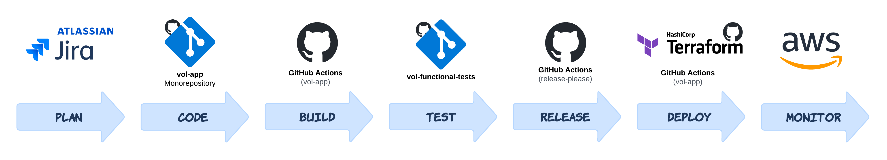

# CI/CD

At a high level, the VOL application's CI/CD pipeline can be visualised as follows:

## Continuous Integration (CI)

:::note

Only parts of the application that have changed are updated during continuous integration.

:::

The CI workflow is triggered by a `pull_request` to the default branch (`main`). The workflow is responsible for building, testing the application & infrastructure, and running Terraform plans on the infrastructure.

**Workflow**: [.github/workflows/ci.yaml](https://github.com/dvsa/vol-app/blob/main/.github/workflows/ci.yaml).

Various tools run on CI to ensure the quality of the codebase:

###  PHP

#### Testing

-   [PHPUnit](https://github.com/sebastianbergmann/phpunit)

#### Linting

-   [PHPStan](https://github.com/phpstan/phpstan)
-   [Psalm](https://github.com/vimeo/psalm)
-   [PHP_CodeSniffer](https://github.com/PHP-CS-Fixer/PHP-CS-Fixer)

#### Security

-   [Snyk](https://snyk.io/)

###  Docker

#### Linting

-   [Hadolint](https://github.com/hadolint/hadolint)

#### Testing

-   Docker build (`docker build`)

#### Security

-   [Trivy](https://github.com/aquasecurity/trivy)
-   [Checkov](https://github.com/bridgecrewio/checkov)

###  Terraform

#### Linting

-   [TFLint](https://github.com/terraform-linters/tflint)
-   Terraform format (`terraform fmt`)

#### Testing

-   Terraform validate (`terraform validate`)
-   Terraform plan (`terraform plan`)

#### Security

-   [Snyk](https://snyk.io/)
-   [Trivy](https://github.com/aquasecurity/trivy)
-   [Checkov](https://github.com/bridgecrewio/checkov)

## Continuous Deployment (CD)

The CD workflow is triggered by a successful merge to the default branch (`main`). The workflow is responsible for building and deploying the application through to the production environment.

**Workflow**: [.github/workflows/cd.yaml](https://github.com/dvsa/vol-app/blob/main/.github/workflows/cd.yaml).

