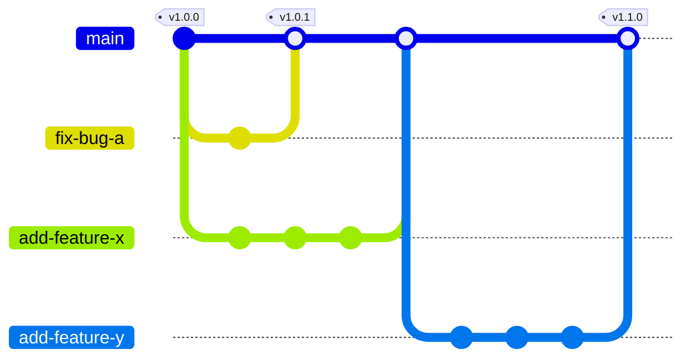

# Contributing

## Coding standards

:::note

All coding standards are enforced via the continuous integration (CI) workflow.

Refer to [ci-cd.md](./ci-cd.md) for more details.

:::

:::note

We run various coding standard tools via Git hooks (refer to `.lintstagedrc.mjs`).

:::tip

In urgent situations, you can skip Git hooks using the `--no-verify` flag during commits.

e.g. `git commit --no-verify -m "fix: your commit message"`

:::

### Global

#### Prettier

Source: https://github.com/prettier/prettier  
How to install: _automatically installed by NPM_  
How to run: `npx prettier`

#### EditorConfig

Source: https://github.com/editorconfig  
How to install: _automatically installed by Composer_  
How to run: _automatically applied by any modern IDE_

###  PHP

#### PHP_CodeSniffer

Source: https://github.com/squizlabs/PHP_CodeSniffer  
How to install: _automatically installed by Composer_  
How to run: `composer run-script phpcs`

#### Local Static Analysis Tools

Run the same static analysis tools used in CI locally before committing:

:::info
Requires Docker Compose stack to be running (`docker compose up -d`)
:::

```bash
# Interactive mode - choose app and tool
npm run lint

# Run specific tools/apps
npm run lint:api              # All tools on API
npm run lint:phpstan          # PHPStan on all apps
npm run phpcbf:selfserve      # Fix PHPCS issues in selfserve
```

Tools included: PHPStan, PHPCS, Psalm, and PHPCBF (auto-fixer).

###  Docker

#### Hadolint

Source: https://github.com/hadolint/hadolint  
How to install: https://github.com/hadolint/hadolint?tab=readme-ov-file#install  
How to run: `hadolint Dockerfile`

###  Terraform

#### TFLint

Source: https://github.com/terraform-linters/tflint  
How to install: https://github.com/terraform-linters/tflint?tab=readme-ov-file#installation  
How to run: `tflint --recursive --config=$(realpath .tflint.hcl) -f compact` (cwd: `infra/terraform/`)

## Versioning

We use [Semantic Versioning](https://semver.org/) for our versioning. New versions are managed by [release-please](https://github.com/googleapis/release-please).

## Commit messages (and pull request titles)

Please write meaningful commit messages. This helps us to understand the changes you made and why you made them. This is a good resource on [how to write good commit messages](https://chris.beams.io/posts/git-commit/).

We use [Conventional Commits](https://www.conventionalcommits.org/en/v1.0.0/) for our commit messages. This allows us to automatically generate a changelog and release notes.

:::warning

Do not mark your commits as breaking changes. This is not appropriate for a non-library repository such as this mono-repository.

:::

## Git workflow

We use the [GitHub flow](https://docs.github.com/en/get-started/using-github/github-flow) for our Git workflow. This means that we use feature branches and pull requests to manage changes to the codebase.

This creates a git graph that looks like this:


