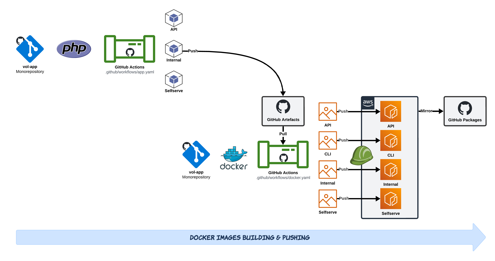

# Overview

Docker images are built and pushed to ECR during the CD pipeline, refer to the [ci-cd.md](../../ci-cd.md) for more details.

# Layers

The VOL application images are built up of the following high-level layers:

# Repositories

The following repositories are used to store the Docker images for the application components:

| ECR Repository                                                                                | Dockerfile Path                                                                              | Application path                                                           |
| --------------------------------------------------------------------------------------------- | -------------------------------------------------------------------------------------------- | -------------------------------------------------------------------------- |
| [`vol-app/api`](https://054614622558.dkr.ecr.eu-west-1.amazonaws.com/vol-app/api)             | [`infra/docker/api`](https://github.com/dvsa/vol-app/tree/main/infra/docker/api)             | [`app/api`](https://github.com/dvsa/vol-app/tree/main/app/api)             |
| [`vol-app/selfserve`](https://054614622558.dkr.ecr.eu-west-1.amazonaws.com/vol-app/selfserve) | [`infra/docker/selfserve`](https://github.com/dvsa/vol-app/tree/main/infra/docker/selfserve) | [`app/selfserve`](https://github.com/dvsa/vol-app/tree/main/app/selfserve) |
| [`vol-app/internal`](https://054614622558.dkr.ecr.eu-west-1.amazonaws.com/vol-app/internal)   | [`infra/docker/internal`](https://github.com/dvsa/vol-app/tree/main/infra/docker/internal)   | [`app/internal`](https://github.com/dvsa/vol-app/tree/main/app/internal)   |

# Image tagging

The Docker images are tagged during the CD pipeline with the following tags:

:::info

**Mutable tags**: `latest`

**Immutable tags**: `[major].[minor].[patch]`, & `[git-sha]`.

:::
