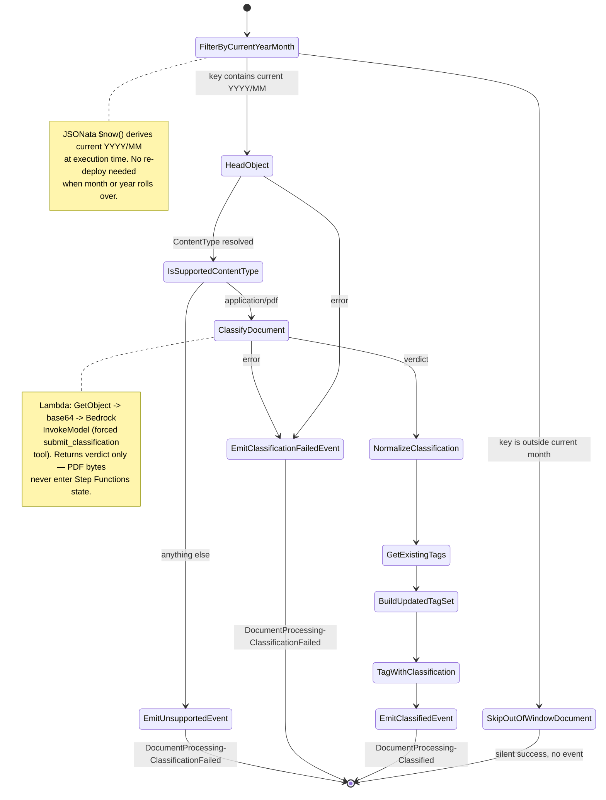

# Classification state machine

Classifies uploaded PDFs using Claude on Amazon Bedrock. Reports the **dominant document type + numeric confidence + page breakdown + document size** as a type-agnostic `DocumentProcessing-Classified` event; downstream routing happens at the EventBridge bus.

## Flow



## States

| State                      | Type             | Purpose                                                 |
| -------------------------- | ---------------- | ------------------------------------------------------- |
| `FilterByCurrentYearMonth` | Choice (JSONata) | Skip documents outside the current year/month path      |
| `SkipOutOfWindowDocument`  | Succeed          | Silent no-op for out-of-window uploads                  |
| `HeadObject`               | Task             | Resolve `ContentType` for the format check              |
| `IsSupportedContentType`   | Choice           | Reject non-PDF files with a typed event                 |
| `ClassifyDocument`         | Task             | Invoke classify-document Lambda                         |
| `NormalizeClassification`  | Pass             | Flatten Lambda verdict into top-level state             |
| `GetExistingTags`          | Task             | Read current S3 object tags                             |
| `BuildUpdatedTagSet`       | Pass (JSONata)   | Merge tags, replacing any existing `Classification` tag |
| `TagWithClassification`    | Task             | Write merged tag set back to S3                         |
| `EmitClassifiedEvent`      | Task             | EventBridge PutEvents                                   |

## Dynamic year/month filter

The first state uses JSONata `$now()`, which is evaluated fresh on every execution:

```jsonata
$contains($states.input.key, $substring($now(), 0, 4) & '/' & $substring($now(), 5, 2))
```

`$now()` returns an ISO 8601 timestamp (e.g. `2026-07-06T14:00:00Z`), so:

- `$substring($now(), 0, 4)` → `"2026"`
- `$substring($now(), 5, 2)` → `"07"`
- Combined check → key must contain `"2026/07"`

Documents uploaded to an old or future year/month path hit `SkipOutOfWindowDocument` (a `Succeed` state) — no event emitted, no Lambda invoked, no Bedrock call made.

## Why a Lambda for classification?

Bedrock requires PDF content as inline base64 — there is no S3 document source or URL source on the Bedrock API. A multi-page PDF base64-encodes to several MB, which exceeds Step Functions' 256 KB state-transition limit. The `classify-document` Lambda handles the full round-trip (S3 `GetObject` → base64 → Bedrock `InvokeModel`) and returns only the small classification verdict, keeping state transitions well within the limit.

## Verdict computation

The Lambda computes the dominant type in JavaScript, not the model. The model reports per-page counts via a forced `submit_classification` tool call; the Lambda then:

1. Filters out `UNCLASSIFIED` pages
2. Sorts remaining types by page count descending
3. Picks the top type as `classification`
4. Computes `classificationConfidence = dominantTypePages / classifiedPages`

This mirrors the JSONata logic from the prior Textract-based SM so the emitted event shape and all downstream routing rules are unchanged.

### Why UNCLASSIFIED is filtered

`UNCLASSIFIED` means "couldn't confidently classify these pages", not "a different document type". For a 47-page doc with 15 `BANK_STATEMENT` + 5 `TRANSACTION_REPORT` + 27 `UNCLASSIFIED` pages:

- **If UNCLASSIFIED counted**: dominant would be UNCLASSIFIED (27 &gt; 15) — doc fails routing.
- **With UNCLASSIFIED filtered**: dominant is BANK_STATEMENT (15 of 20 classified pages → 0.75 confidence), routes correctly.

The full `pageBreakdown` (including UNCLASSIFIED) is still emitted for caseworker visibility.

## Emitted event

### Success

```json
{
    "Source": "custom.documentProcessing",
    "DetailType": "DocumentProcessing-Classified",
    "Detail": {
        "bucket": "...",
        "key": "...",
        "object": { "size": 7390634, "versionId": "..." },
        "config": {
            "outputBucket": "vol-idp-dev-output",
            "bedrockProjectArn": "arn:aws:bedrock:eu-west-1:...:data-automation-project/...",
            "bedrockProfileArn": "arn:aws:bedrock:eu-west-1:...:data-automation-profile/eu.data-automation-v1",
            "bedrockProjectStage": "LIVE"
        },
        "classification": "BANK_STATEMENT",
        "classificationConfidence": 0.75,
        "totalPages": 47,
        "classifiedPages": 20,
        "dominantTypePages": 15,
        "pageBreakdown": [
            { "type": "UNCLASSIFIED", "pageCount": 27 },
            { "type": "BANK_STATEMENT", "pageCount": 15 },
            { "type": "TRANSACTION_REPORT", "pageCount": 5 }
        ],
        "documentSizeBytes": 7390634,
        "modelId": "eu.anthropic.claude-haiku-4-5-20251001-v1:0"
    }
}
```

### Failure

- `DocumentProcessing-ClassificationFailed` — Lambda error, Bedrock error, S3 error, or document too large for inline classification (&gt;14 MB).
- `DocumentProcessing-ClassificationFailed` — file content-type is not `application/pdf`.

## EventBridge routing

The single `Classified` event is type-agnostic. EventBridge rules apply routing policy. Bank-statement extraction matches:

```json
{
    "source": ["custom.documentProcessing"],
    "detail-type": ["DocumentProcessing-Classified"],
    "detail": {
        "classification": ["BANK_STATEMENT"],
        "classificationConfidence": [{ "numeric": [">=", 0.75] }],
        "totalPages": [{ "numeric": ["<=", 100] }],
        "documentSizeBytes": [{ "numeric": ["<=", 209715200] }]
    }
}
```

Adding a new document type is one new EventBridge rule + one new extraction SM — the classification SM never changes.

## Timing

| Step                                      | Typical |
| ----------------------------------------- | ------- |
| FilterByCurrentYearMonth (JSONata Choice) | &lt;1 s |
| HeadObject + IsSupportedContentType       | &lt;1 s |
| classify-document Lambda (S3 + Bedrock)   | 5–15 s  |
| Tag operations + EmitClassifiedEvent      | &lt;1 s |
| Total                                     | ~5–15 s |
