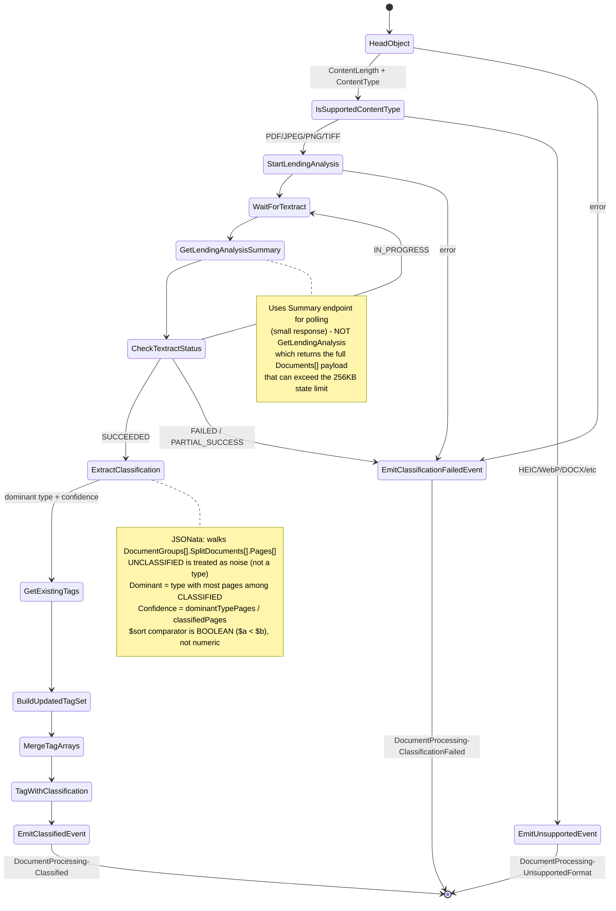

# Classification state machine

Textract Lending Analysis. Reports the **dominant document type + numeric confidence + page breakdown + document size** as a type-agnostic event; downstream routing happens at the EventBridge bus.

## Flow



## States

| State                                       | Type           | Purpose                                         |
| ------------------------------------------- | -------------- | ----------------------------------------------- |
| `HeadObject`                                | Task           | Get ContentLength + ContentType                 |
| `IsSupportedContentType`                    | Choice         | Reject HEIC, WebP, DOCX with a typed event      |
| `StartLendingAnalysis`                      | Task           | Start Textract Lending job                      |
| `WaitForTextract`                           | Wait           | Configurable poll interval (default 8 s)        |
| `GetLendingAnalysisSummary`                 | Task           | Poll + (when SUCCEEDED) get the Summary         |
| `CheckTextractStatus`                       | Choice         | IN_PROGRESS / SUCCEEDED / FAILED branching      |
| `ExtractClassification`                     | Pass (JSONata) | Compute dominant type + confidence              |
| `GetExistingTags` → `TagWithClassification` | Task chain     | Preserve original tags, append `Classification` |
| `EmitClassifiedEvent`                       | Task           | EventBridge PutEvents                           |

## The JSONata calculation

```jsonata
$groups := $states.input.textract.summary.Summary.DocumentGroups;
$pagesIn := function($g){ $sum($g.SplitDocuments.($count(Pages))) };

$breakdown := $map($groups, function($g){ { 'type': $g.Type, 'pageCount': $pagesIn($g) } });
$sorted := $sort($breakdown, function($a, $b){ $a.pageCount < $b.pageCount });
$totalPages := $sum($breakdown.pageCount);

$classifiedBreakdown := $filter($breakdown, function($b){ $b.type != 'UNCLASSIFIED' });
$classifiedPages := $sum($classifiedBreakdown.pageCount);
$sortedClassified := $sort($classifiedBreakdown, function($a, $b){ $a.pageCount < $b.pageCount });

$dominantType := $count($sortedClassified) > 0 ? $sortedClassified[0].type : 'UNCLASSIFIED';
$dominantCount := $count($sortedClassified) > 0 ? $sortedClassified[0].pageCount : 0;
$confidence := $classifiedPages > 0 ? $dominantCount / $classifiedPages : 0;
```

### JSONata `$sort` gotcha

JSONata's `$sort` takes a **boolean** comparator: returns `true` if `$a` should come _after_ `$b`. Not numeric like JavaScript's `Array.prototype.sort`. Any non-zero number is truthy, so a numeric comparator (`$b.x - $a.x`) effectively means "always swap" — output ends up reverse of input order, often by accident matching ascending instead of descending. Use a boolean comparator: `$a.pageCount < $b.pageCount`.

### Why UNCLASSIFIED is filtered

Textract's UNCLASSIFIED is "couldn't classify these pages", not "different document type". For a 47-page doc with 15 BANK_STATEMENT + 5 INVOICES + 27 UNCLASSIFIED pages:

- **If UNCLASSIFIED counted**: dominant would be UNCLASSIFIED (27 > 15) — doc fails routing.
- **With UNCLASSIFIED filtered**: dominant is BANK_STATEMENT (15 of 20 classified pages → 0.75 confidence), routes correctly.

The full `pageBreakdown` still includes UNCLASSIFIED for caseworker visibility.

## Emitted event

### Success

```json
{
  "Source": "custom.documentProcessing",
  "DetailType": "DocumentProcessing-Classified",
  "Detail": {
    "bucket": "...",
    "key": "...",
    "object": { "size": 7390634, "versionId": "..." },
    "config": { ... },
    "classification": "BANK_STATEMENT",
    "classificationConfidence": 0.75,
    "totalPages": 47,
    "classifiedPages": 20,
    "dominantTypePages": 15,
    "pageBreakdown": [
      { "type": "UNCLASSIFIED",   "pageCount": 27 },
      { "type": "BANK_STATEMENT", "pageCount": 15 },
      { "type": "INVOICES",       "pageCount":  5 }
    ],
    "documentSizeBytes": 7390634,
    "textractJobId": "..."
  }
}
```

### Failure

- `DocumentProcessing-ClassificationFailed` — Textract job failed, polling errored, or non-PDF/image content type.
- `DocumentProcessing-UnsupportedFormat` — file content-type isn't PDF / JPEG / PNG / TIFF.

## EventBridge routing

The single Classified event is type-agnostic. EventBridge rules apply routing policy. Bank-statement extraction matches:

```typescript
{
  source: ['custom.documentProcessing'],
  detailType: ['DocumentProcessing-Classified'],
  detail: {
    classification: ['BANK_STATEMENT'],
    classificationConfidence: [{ numeric: ['>=', 0.75] }],
    totalPages: [{ numeric: ['<=', 100] }],
    documentSizeBytes: [{ numeric: ['<=', 209715200] }]
  }
}
```

Values live in `config/routing-policy.json`. Adding a payslip extraction tomorrow is one new rule + one new SM — classification doesn't change.

## Configuration

- **Poll wait**: `config.waitSeconds` (default 8 s, set by the CDK config payload).
- **Timeout**: 15 minutes.
- **Retry on Textract throttling**: 6 attempts, 2 s base, ×2 backoff.

## Why not `GetLendingAnalysis`?

`getLendingAnalysis` returns the full `Documents[]` and `Blocks[]` arrays once the job succeeds. On a busy multi-page doc, that can exceed Step Functions' 256 KB state-transition limit and crash the SM. `MaxResults` only limits Blocks pagination, not Documents content — there's no parameter to make the response small. `getLendingAnalysisSummary` returns the same `JobStatus` plus only the small `Summary.DocumentGroups` we need — works as both polling endpoint and final fetch.

## Timing

| Step                                          | Typical  |
| --------------------------------------------- | -------- |
| Textract job start                            | <1 s     |
| Polling loop (Summary, 8s wait between polls) | 30–60 s  |
| ExtractClassification + tag operations        | <1 s     |
| Total                                         | ~30–60 s |
