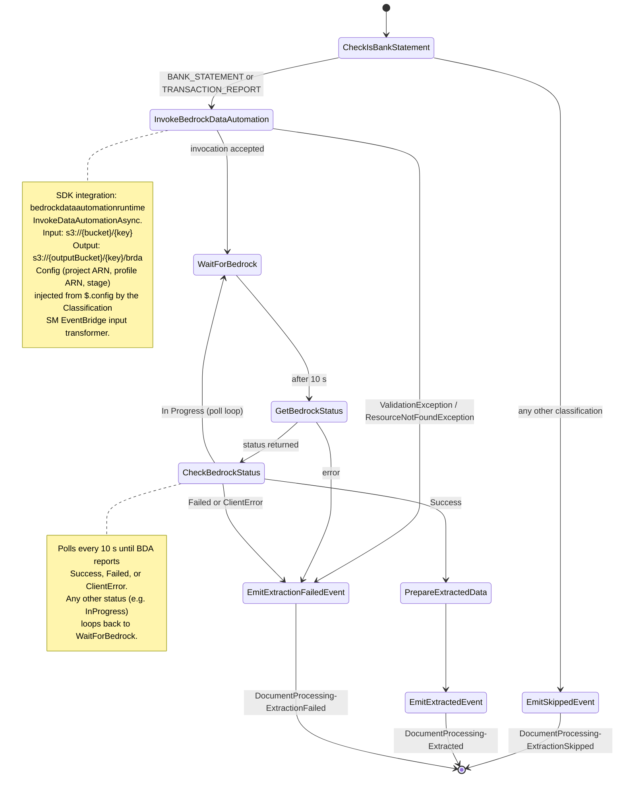

# Extraction state machine

Extracts structured data from bank statement PDFs using Bedrock Data Automation (BDA). Invokes BDA asynchronously against a custom bank statement blueprint, polls until complete, then emits a `DocumentProcessing-Extracted` event for downstream processing.

## Flow



## States

| State                         | Type   | Purpose                                                               |
| ----------------------------- | ------ | --------------------------------------------------------------------- |
| `CheckIsBankStatement`        | Choice | Guard: only BANK_STATEMENT and TRANSACTION_REPORT proceed             |
| `InvokeBedrockDataAutomation` | Task   | Async BDA invocation — returns InvocationArn immediately              |
| `WaitForBedrock`              | Wait   | 10-second pause before polling                                        |
| `GetBedrockStatus`            | Task   | Poll `GetDataAutomationStatus` using the InvocationArn                |
| `CheckBedrockStatus`          | Choice | Route on `Status`: Success / Failed / ClientError / still-in-progress |
| `PrepareExtractedData`        | Pass   | Flatten state — promotes BDA invocation metadata to top level         |
| `EmitExtractedEvent`          | Task   | EventBridge PutEvents — `DocumentProcessing-Extracted`                |
| `EmitSkippedEvent`            | Task   | EventBridge PutEvents — `DocumentProcessing-ExtractionSkipped`        |
| `EmitExtractionFailedEvent`   | Task   | EventBridge PutEvents — `DocumentProcessing-ExtractionFailed`         |

## Why `CheckIsBankStatement` exists

The EventBridge routing rule already filters on classification before starting this SM, so under normal operation `CheckIsBankStatement` is always satisfied. The state is a defensive guard — if the SM is triggered manually or routing policy changes, documents that aren't bank statements skip directly to `EmitSkippedEvent` rather than wasting a BDA invocation.

## BDA configuration

The BDA project and blueprint are managed in `modules/idp/bda.tf` (Terraform, via the `awscc` provider):

| Setting                | Value      | Reason                                                                                                                          |
| ---------------------- | ---------- | ------------------------------------------------------------------------------------------------------------------------------- |
| Splitter               | `ENABLED`  | Segments bundled/mixed PDFs; only segments matching the blueprint get `custom_output`. Raises async page limit from 20 to 3000. |
| Document granularity   | `DOCUMENT` | No per-page or per-word noise in the output JSON                                                                                |
| Bounding box           | `DISABLED` | Position metadata not needed by downstream Claude analysis                                                                      |
| Text format            | `MARKDOWN` | Plain text / HTML / CSV duplicates disabled                                                                                     |
| Additional file format | `DISABLED` | JSON only — no JSON+ side files                                                                                                 |
| Generative field       | `DISABLED` | No BDA-generated descriptions or summaries                                                                                      |
| Image / video / audio  | `DISABLED` | PDFs only — prevents BDA running unnecessary modalities                                                                         |

## Custom blueprint

`modules/idp/config/bank-statement-blueprint.json` defines the structured extraction schema. Key design decisions:

- **Signed balances and amounts** — negative values represent debits/overdrafts. Overdraft state flows through as data (e.g. `-250.00`) rather than being reconstructed by the downstream Claude analysis prompt from DR/OD markers.
- **Running balance per transaction** — enables Claude to verify balance continuity without re-summing all transactions.
- **Arranged overdraft limit** — extracted explicitly to support operator licensing financial standing checks.

## Config injection

All BDA config (`outputBucket`, `bedrockProjectArn`, `bedrockProfileArn`, `bedrockProjectStage`) is injected into the SM input via the Classification SM's EventBridge input transformer in `modules/idp/main.tf`. The extraction ASL consumes it via `$.config.*` — no hardcoded ARNs in the ASL.

## Emitted events

### Success — `DocumentProcessing-Extracted`

```json
{
    "Source": "custom.documentProcessing",
    "DetailType": "DocumentProcessing-Extracted",
    "Detail": {
        "bucket": "...",
        "key": "...",
        "object": { "size": 7390634, "versionId": "..." },
        "config": { "outputBucket": "vol-idp-dev-output", "..." : "..." },
        "classification": "BANK_STATEMENT",
        "classificationConfidence": 0.75,
        "totalPages": 47,
        "classifiedPages": 20,
        "dominantTypePages": 15,
        "pageBreakdown": [...],
        "documentSizeBytes": 7390634,
        "modelId": "eu.anthropic.claude-haiku-4-5-20251001-v1:0",
        "bedrockInvocationArn": "arn:aws:bedrock:eu-west-1:...:async-invoke/...",
        "bedrockInvocationId": "...",
        "extractedDataS3Bucket": "vol-idp-dev-output",
        "extractedDataS3KeyPrefix": "migration/olcs/.../document.pdf/brda/"
    }
}
```

### Skip — `DocumentProcessing-ExtractionSkipped`

Emitted when the document classification is not a bank statement type. Includes `bucket`, `key`, `object`, `config`, `classification`, and `reason`.

### Failure — `DocumentProcessing-ExtractionFailed`

Emitted on BDA `Failed`/`ClientError` status or SDK errors. Includes `bucket`, `key`, `object`, `config`, `reason`, `error`, `cause`, and the full `bedrockStatus` object.

## Timing

| Step                                          | Typical   |
| --------------------------------------------- | --------- |
| CheckIsBankStatement                          | &lt;1 s   |
| InvokeBedrockDataAutomation                   | 1–3 s     |
| BDA processing (polling loop, varies by size) | 30 s–10 m |
| PrepareExtractedData + EmitExtractedEvent     | &lt;1 s   |
| **Total**                                     | ~1–10 min |

SM timeout is 30 minutes to cover large or complex documents.
