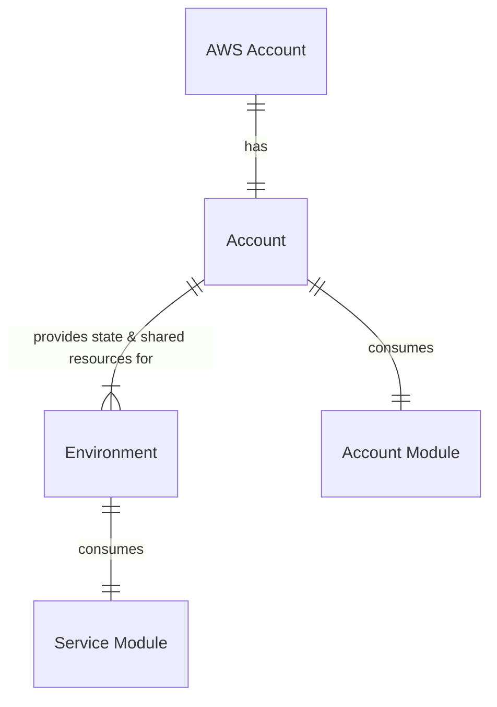

# Overview

VOL app infrastructure is deployed using Terraform. The Terraform code is located in
the [/infra/terraform](https://github.com/dvsa/vol-app/tree/main/infra/terraform) directory.

The Terraform code is split into multiple modules, located
in [/modules](https://github.com/dvsa/vol-app/tree/main/infra/terraform/modules/) directory. Each module will contain an
auto-generated `README.md` file which will provide more information about the module.

:::info

`README.md` files are automatically generated by [terraform-docs](https://github.com/terraform-docs/terraform-docs).

:::

The relationship between the Terraform directory structure is as per the diagram below:

## Accounts

There are 2 AWS accounts:

| Alias     | Account ID     | <svg width="13.5" height="13.5" aria-hidden="true" viewBox="0 0 24 24" class="iconExternalLink_nPIU"><path fill="currentColor" d="M21 13v10h-21v-19h12v2h-10v15h17v-8h2zm3-12h-10.988l4.035 4-6.977 7.07 2.828 2.828 6.977-7.07 4.125 4.172v-11z"></path></svg>                                                   |
| --------- | -------------- | ----------------------------------------------------------------------------------------------------------------------------------------------------------------------------------------------------------------------------------------------------------------------------------------------------------------- |
| `nonprod` | `054614622558` | [<svg width="13.5" height="13.5" aria-hidden="true" viewBox="0 0 24 24" class="iconExternalLink_nPIU"><path fill="currentColor" d="M21 13v10h-21v-19h12v2h-10v15h17v-8h2zm3-12h-10.988l4.035 4-6.977 7.07 2.828 2.828 6.977-7.07 4.125 4.172v-11z"></path></svg>](https://nonprod.signin.aws.amazon.com/console/) |
| `dvsa`    | `146997448015` | [<svg width="13.5" height="13.5" aria-hidden="true" viewBox="0 0 24 24" class="iconExternalLink_nPIU"><path fill="currentColor" d="M21 13v10h-21v-19h12v2h-10v15h17v-8h2zm3-12h-10.988l4.035 4-6.977 7.07 2.828 2.828 6.977-7.07 4.125 4.172v-11z"></path></svg>](https://dvsa.signin.aws.amazon.com/console/)    |

:::warning

The accounts also contain resources that are managed in the [vol-terraform](https://github.com/dvsa/vol-terraform) repository.

The infrastructure managed in this repository is defined in [RFC-005](../../rfc/rfc-005-add-terraform-to-mono-repository.md).

:::

## Environments

There are 2 fixed environments in each AWS account:

| Name   | Description    | Account   | Region      |
| ------ | -------------- | --------- | ----------- |
| `dev`  | Development    | `nonprod` | `eu-west-1` |
| `int`  | Integration    | `nonprod` | `eu-west-1` |
| `prep` | Pre-production | `dvsa`    | `eu-west-1` |
| `prod` | Production     | `dvsa`    | `eu-west-1` |

:::danger

During the transition to the new infrastructure. The environments above will map to the existing environments in the current infrastructure.

| Environment | Existing Environment | Account   |
| ----------- | -------------------- | --------- |
| `dev`       | `dev`                | `nonprod` |
| `int`       | `qa`                 | `nonprod` |
| `prep`      | `pp`                 | `dvsa`    |
| `prod`      | `app`                | `dvsa`    |

:::
