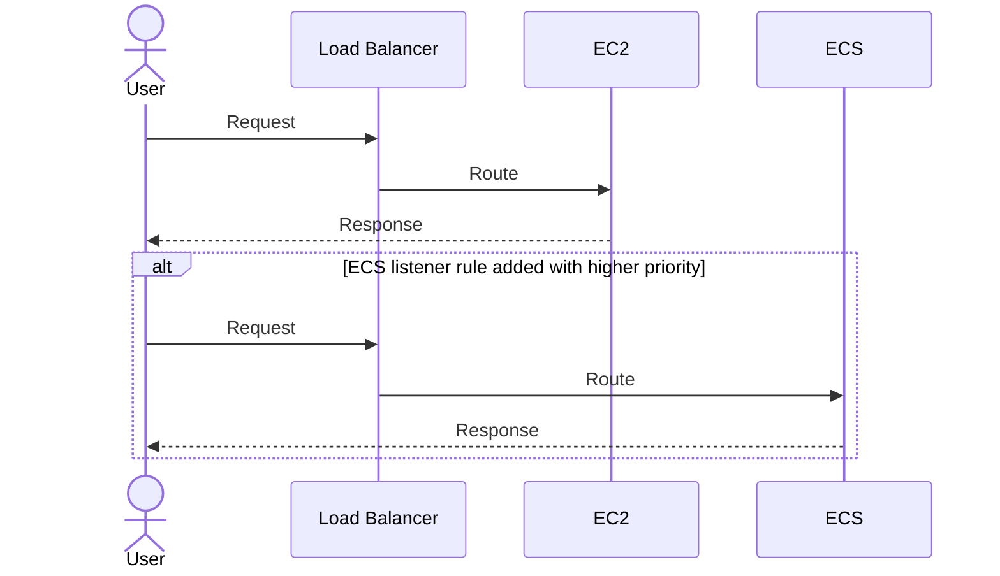

# Repositories

The VOL infrastructure is divided into two repositories: `vol-app` and `vol-terraform`.

The rationale for this split is explained in RFC-005. At a high level, this approach was the only identified feasible option for implementing the migration the VOL application to ECS and establishing CI/CD workflows.

:::danger

The `vol-app` repository depends on the `vol-terraform` repository. This relationship _must_ remain unidirectional to prevent circular dependencies. Circular dependencies can disrupt disaster recovery processes and complicate infrastructure re-creation.

:::

### Controlling Traffic Flow

ECS-related resources created by `vol-app` were intentionally designed to coexist with the existing EC2 infrastructure provisioned by the `vol-terraform` repository. This approach ensures a smooth transition to the new infrastructure. Traffic flow can be managed by setting a listener rule with a higher priority (`0` being the highest priority).



:::tip

The listener rule is controlled by the variable: `service.listener_rule_enable` variable.

To push traffic to the ECS service, set `service.listener_rule_enable = true`. This can be controlled per environment _and_ service.

```hcl showLineNumbers
# vol-app/infra/terraform/environments/[env]/main.tf

module "service" {
  source = "../../modules/service"

  # ...

  services = {
    "service" = {
      # ...

      // highlight-next-line
      listener_rule_enable = true # default is `true`.
    }
  }
}
```
