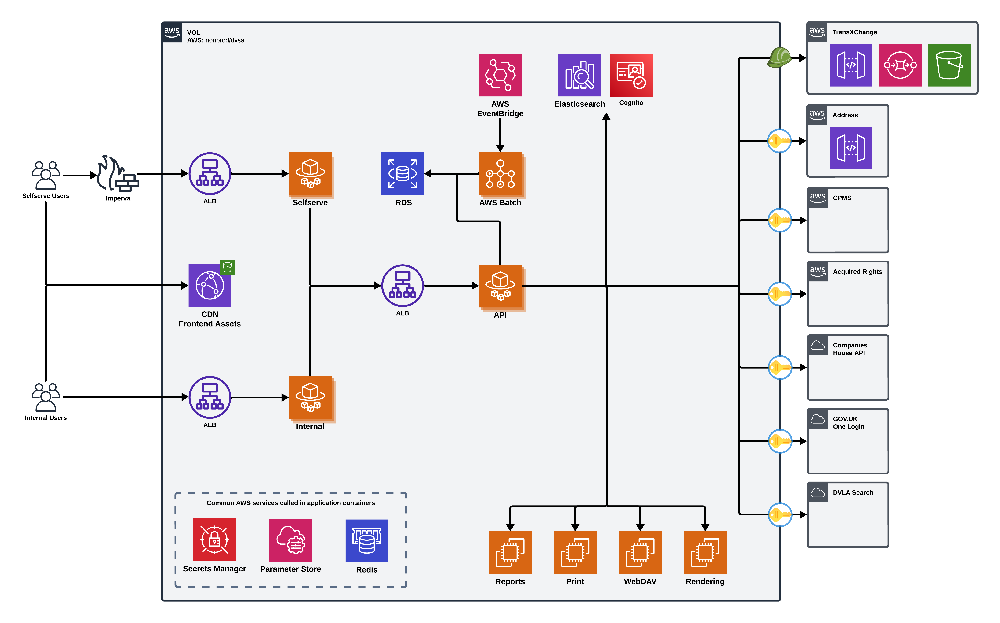

# VOL Application Technical Architecture

## Overview



## Authentication & Authorization

### User Authentication (AWS Cognito)

-   **Implementation:**
    -   AWS Cognito User Pools for identity management
-   **User Types:**
    -   Public users (operators, transport managers)
    -   Internal users (DVSA staff)

### Third-Party API Authentication (Azure AD)

-   **Implementation:**
    -   Azure Active Directory integration
    -   Token acquisition and caching

## Core Components

### Frontend Services

#### Self-Service Portal

-   **Technology Stack:**
    -   PHP 8.x with Laminas Framework
    -   Nginx web server with PHP-FPM
    -   JavaScript/jQuery for client-side functionality
-   **Key Features:**
    -   Cognito-backed user authentication
    -   Form handling and validation
    -   Document upload with virus scanning (ClamAV)
-   **Container Configuration:**
    -   Runs in ECS with PHP-FPM and Nginx

#### Internal Portal

-   **Technology Stack:**
    -   PHP 8.x with Laminas Framework
    -   Nginx web server with PHP-FPM
-   **Key Features:**
    -   Staff authentication via Cognito
    -   Administrative functions
    -   Case management interface
    -   Document processing

### Backend Services

#### API Service

-   **Technology Stack:**
    -   PHP 8.x with Laminas Framework
    -   CQRS & RESTful API design patterns
    -   Cognito JWT validation
-   **Key Features:**
    -   Token validation and authorization
    -   Business logic implementation
    -   Data validation and processing
    -   Integration point for external services
    -   Azure AD token management for external APIs
-   **API Design:**
    -   CQRS & RESTful endpoints for resource operations

#### Search Service

-   **Technology Stack:**
    -   Elasticsearch for search functionality
    -   Logstash for data processing
    -   Custom indexing configurations
-   **Features:**
    -   Full-text search capabilities
    -   Fuzzy matching
    -   Faceted search
    -   Real-time indexing
-   **Data Flow:**
    -   Database changes captured
    -   Processed through Logstash
    -   Indexed in Elasticsearch
    -   Served via authenticated API endpoints

## Data Layer

### Primary Database

-   **Technology:** Amazon RDS (MySQL)
-   **Key Characteristics:**
    -   Handles transactional data
    -   Stores application state

### Caching Layer

-   **Technology:** Amazon ElastiCache (Redis)
-   **Usage:**
    -   Token caching (Azure AD)
    -   API response caching
    -   Session data
-   **Configuration:**
    -   Memory-optimized instances
    -   Encryption at rest
    -   Automatic failover

## Infrastructure Components

### Load Balancing

-   **Implementation:** Application Load Balancer (ALB)
-   **Configuration:**
    -   TLS termination
    -   HTTP/2 enabled
    -   Path-based routing
    -   Health check monitoring
-   **Traffic Flow:**
    ```
    Internet → CloudFront → ALB → ECS Services
    ```

### Container Orchestration

-   **Platform:** Amazon ECS (Elastic Container Service)
-   **Configuration:**
    -   Task definitions per service
    -   Auto-scaling policies
    -   Service discovery
    -   Rolling deployments
-   **Networking:**
    -   Private subnets
    -   VPC endpoints
    -   Security group isolation

### Content Delivery

-   **CDN:** Amazon CloudFront
-   **Usage:**
    -   Static asset delivery
    -   Cache optimization
    -   Geographic distribution
    -   DDoS protection

### Storage Services

1. **Document Storage:**

    - S3 for file storage
    - Versioning enabled
    - Lifecycle policies
    - Server-side encryption

2. **Backup Storage:**
    - Automated database backups
    - Document versioning
    - Disaster recovery copies

## Integration Points

### External Services Authentication

1. **Companies House API:**

    - Azure AD authentication
    - OAuth2 client credentials flow
    - Token caching and refresh
    - Rate limit management

2. **Payment Processing:**

    - Secure payment handling
    - Transaction management
    - Receipt generation
    - Service-specific authentication

3. **Government Gateway:**
    - Azure AD authentication
    - Token management
    - Secure data exchange
    - Audit logging

### Internal Integration

1. **Message Queues:**

    - Asynchronous processing
    - Event-driven updates
    - Work distribution
    - Error handling

2. **Service Communication:**
    - Internal API calls with JWT validation
    - Service discovery
    - Circuit breaking
    - Retry mechanisms

## Monitoring and Operations

### Observability

1. **Logging:**

    - Centralized log collection
    - Authentication event logging
    - Token lifecycle tracking
    - Alert triggering

2. **Metrics:**

    - Authentication success/failure rates
    - API performance metrics

3. **Tracing:**
    - Request tracing with auth context
    - Performance analysis
    - Error tracking
    - Dependency mapping

### Operational Tools

1. **Deployment:**

    - CI/CD pipelines
    - Rollback capabilities
    - Configuration management

2. **Maintenance:**
    - Database migrations
    - Backup procedures
    - Scaling operations
    - Security updates

## Environment Configuration

### Production Environment

-   High availability configuration
-   Enhanced security controls
-   Production-grade resources

### Non-Production Environments

-   Development environment
-   Integration testing
-   Pre-production validation
